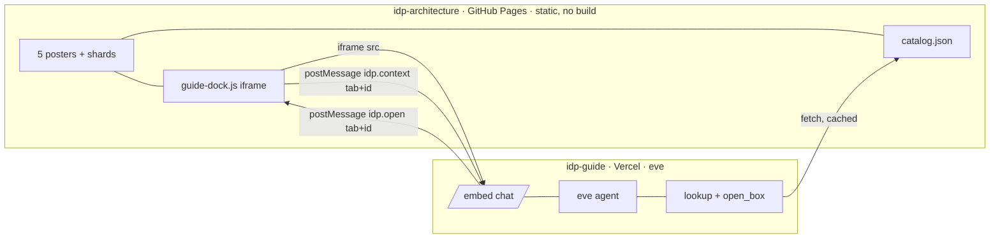

# Build Ledger — v1 (idp-guide: on-site study agent for the IDP posters, 2026-08-20)

_Completing these tasks produces **v1** of the on-site guide: a grounded Q&A dock that rides on top of the existing posters and can jump the page to the matching box. Source of truth for scope is the pasted build brief (`idp-guide-build-prompt.md`); this file is the human-readable sequence and the living design. **WIP limit = 1 within a task, but streams A/B/C/D run in parallel** (see Execution Order). A task is DONE when every `*Accept:*` box passes on a real page (local static server or Pages preview), not just in theory._

_**The thesis in one line:** three jobs, three tools on the agent. v1 ships the first job (Questions) and its two tools (`lookup`, `open_box`). v2 adds Feedback (`flag_clarity`). v3 adds Deeper understanding (tutor). Everything is grounded in `catalog.json`, generated from the same shards the pages load — the agent never invents a hop._

_**Status legend:** ✅ done · 🟡 partial · ⬜ not started. **Owners:** 🤖 Claude Code / Cursor agents build · 👤 Jacob reviews + applies copy edits + holds Vercel/GitHub credentials. The on-site agent never pushes to `main`._

---

## 🏛 System Design — idp-guide (LIVING DOCUMENT)

> **⚠️ KEEP THIS UPDATED.** Any change to a contract (catalog schema, postMessage protocol, the `idp:render` seam) must update this section in the same commit that touches the code. The three frozen contracts in §7 are what let A/B/C/D build without coordinating — do not change them silently.

### 1. Product thesis
**Three jobs, three tools on the agent.** A visitor studying the five posters (Map, Golden path, v2, Agents, Metal) can ask questions and get answers drawn only from the site's own panel copy, with the poster jumping to the box that backs the answer. Ask "why is transatlantic 65–75 ms?" on Golden path and it opens Metal and highlights the subsea hop — it does not invent a sixth story.

| Job | What it is | Tool(s) | Version |
| --- | --- | --- | --- |
| **Questions** | Grounded Q&A from panel copy, highlights the matching box | `lookup`, `open_box` | **v1** |
| **Feedback** | "This is unclear" tags the open data-id, files a `clarity` GitHub issue; a human applies the edit | `flag_clarity` | v2 |
| **Deeper understanding** | Tutor mode: Socratic follow-ups, "trace this request", "what fails if this box dies", quiz from the numbered badges | `lookup`, `open_box` (tutor prompt) | v3 |

### 2. Functional requirements (FR)
| ID | Requirement | Status | Task(s) |
|---|---|---|---|
| **FR-1** | `catalog.json` generated from the live DATA shards (`g/v/a/m-data-*`) + Map content, served on Pages, no auth | ⬜ | IG-01 |
| **FR-2** | Hash-open: `metal.html#e-subsea` opens the Subsea panel with no click; every `render` reflects into the hash | ⬜ | IG-02 |
| **FR-3** | Guide dock: collapsible iframe on all five tabs, above the 36px tab bar, fails silent if blocked | ⬜ | IG-03 |
| **FR-4** | postMessage both ways: site→agent `idp.context`, agent→site `idp.open` (same-tab render or cross-tab navigate) | ⬜ | IG-03, IG-04 |
| **FR-5** | eve agent: grounded Q&A citing a data-id, `lookup` + `open_box` tools, refuses to invent boxes | ⬜ | IG-04 |
| **FR-6** | Embed chat UI at `/embed`, speaks the protocol, streams replies, "Open on poster" affordance | ⬜ | IG-04 |
| **FR-7** | End-to-end: "why is transatlantic 65–75 ms?" from Golden path lands on Metal `e-subsea` | ⬜ | IG-05 |

### 3. Non-functional requirements (NFR)
| ID | Requirement | Status | Where |
|---|---|---|---|
| **NFR-1 Grounding** | Agent answers only from `catalog.json`; unknown → says so + offers closest ids. No invented hops, latencies, vendors, boxes | ⬜ | IG-04 |
| **NFR-2 Posters-first** | If Vercel/iframe is down, the five tabs still work with no dock. No hard dependency on the agent | ⬜ | IG-03 |
| **NFR-3 Small diffs** | Static repo, no bundler. New JS is a plain file; `guide-dock.js` < 8KB; existing posters not reformatted | ⬜ | IG-02, IG-03 |
| **NFR-4 Origin safety** | postMessage restricted to `jacobdurrah.github.io` + `localhost`; iframe sandboxed | ⬜ | IG-03, IG-04 |
| **NFR-5 Copy voice** | Site + agent copy uses commas/periods/parentheses, no em dashes | ⬜ | IG-01, IG-04 |
| **NFR-6 Cost guard** | No wide-open high-cost model with no limit; simple per-IP/session rate limit if easy | ⬜ | IG-04 |
| **NFR-7 Freshness** | Agent fetches `catalog.json` at chat start, so a published copy fix teaches the next day | ⬜ | IG-01, IG-04 |

### 4. Architecture (high level)

- **Two repos, on purpose.** `idp-architecture` stays the posters (Pages, no build, same shards) and gains three small things: hash-open, `catalog.json`, and the dock. `idp-guide` is the new eve app on Vercel and never owns the SVG. If Vercel auth flakes, the posters still work.
- **eve** is the agent framework (`npx eve@latest init idp-guide`). After init, `node_modules/eve/docs/README.md` is the source of truth for eve APIs — do not guess them.
- **Models** via Vercel AI Gateway model strings. No provider API keys unless asked.
- **Skip:** Next.js rewrite of the posters, LangChain, Vercel Chat SDK, Slack. Reason Pages is the source of truth: a previous Vercel auth mix-up.

### 5. Entities (data model) — `catalog.json`
One record per `(tab, id)`, generated from `window.IDP_DATA` (keys `n/p/w/y/d` + Metal's `medium/speed/latency/bandwidth/owner`) and Map's `window.IDP_CONTENT`. Field map is confirmed against `metal-ui.js`: `n→name, p→plane, w→what, y→why, d→notes`.
```json
{
  "id": "e-subsea", "tab": "metal", "name": "Subsea hop", "plane": "photon",
  "what": "...", "why": "...", "notes": ["..."],
  "medium": "optional", "speed": "optional", "latency": "optional",
  "bandwidth": "optional", "owner": "optional",
  "href": "/idp-architecture/metal.html#e-subsea"
}
```
Generated, never hand-written. If a naive push truncates (this repo has bitten tools around ~8–11KB), split into `catalog-0.json …` + a manifest; prefer one file if it stays reasonable.

### 6. Interfaces
- **Tools (v1):** `lookup(id | query) → up to ~8 catalog records` (fetch + cache `catalog.json` from `IDP_CATALOG_URL`, default `https://jacobdurrah.github.io/idp-architecture/catalog.json`). `open_box(tab, id) → {ok:true}` after the embed posts `idp.open`; only the five tab names, only ids that exist in the catalog.
- **Skills (v1):** `ask` (default, grounded Q&A) · `tutor` (stub only — offers to walk Golden 1–12 / Metal 1–13 using lookup + open_box; no quizzes yet).
- **Env:** `IDP_CATALOG_URL` (agent), `IDP_GUIDE_ORIGIN` (dock, overridable; default `http://localhost:3000` on localhost).

### 7. Frozen contracts (do not change silently — this is what makes A/B/C/D independent)
1. **catalog schema** — the §5 record shape. Stream D builds `lookup` against a fixture of this; Stream A produces the real file. They meet only at integration.
2. **postMessage protocol** — site→agent `{type:"idp.context", tab, id, href}` (id may be `"overview"`/omitted); agent→site `{type:"idp.open", tab, id}`. Same tab → `render(id)`; different tab → navigate to `<file>#id`. Tab→file: map=index.html, golden=golden.html, v2=v2.html, agents=agents.html, metal=metal.html. Ignore messages from any origin outside `jacobdurrah.github.io` + `localhost`. No other message types in v1.
3. **`idp:render` seam** — the one seam Streams B and C share. On every `render(id)`, the UI files dispatch `window.dispatchEvent(new CustomEvent('idp:render', {detail:{id, tab}}))`. B owns firing it (inside `render`); C listens to send `idp.context`. Neither touches the other's code.

---

## ⚡ EXECUTION ORDER — the one list that matters

_Four build streams, then one join. **A/B/C land in `idp-architecture` and share no files** (A = new files, B = edits `*-ui.js`/`app.js`, C = new `guide-dock.js` + edits `*.html`). **D is the separate `idp-guide` repo.** All four build against the §7 frozen contracts with zero live coordination. Only IG-05 (integration + e2e + deploy) needs everything merged._

| Stream | Task | Repo | Touches | Depends only on | Owner |
|---|---|---|---|---|---|
| **A** | IG-01 catalog generator + `catalog.json` | idp-architecture | *new:* `tools/build-catalog.js`, `catalog.json` | existing shards + schema §5 | 🤖 |
| **B** | IG-02 hash-open + `idp:render` seam | idp-architecture | *edit:* `golden-ui.js`, `v2-ui.js`, `agents-ui.js`, `metal-ui.js`, `app.js` | existing `render(id)` + seam §7.3 | 🤖 |
| **C** | IG-03 dock + postMessage | idp-architecture | *new:* `guide-dock.js`; *edit:* 5 `*.html` | protocol §7.2 + seam §7.3 | 🤖 |
| **D** | IG-04 eve app (tools, embed, prompt) | idp-guide (new) | whole new repo | schema §5 + protocol §7.2 | 🤖 |
| join | IG-05 integration + e2e + deploy | both | dock origin flip, live catalog URL | A+B+C+D merged | 🤖👤 |

**Suggested split:** one agent takes A+B+C in this repo (shares a mental model of the posters), one agent takes D in the new repo, in parallel. Or fan A/B/C to three agents — the frozen `idp:render` seam is what makes that safe. **Cursor** is the natural owner of D (needs eve docs + Vercel context); **Claude Code** the natural owner of A/B/C.

**The dependency in one sentence:** shards → catalog (A) is the only thing anyone else eventually reads, and even that is stubbed by a fixture, so A/B/C/D all start at once and converge at IG-05.

**Not parallel (integration, not building):** the dock's production origin is a one-line constant flip once D deploys; the e2e test needs everything merged. Both live in IG-05.

---

## PHASE v1 — Dock + grounded Q&A + highlight
_Goal: a visitor asks a question on any tab, gets a grounded answer citing a data-id, and the poster jumps to that box. v2 (clarity issues) and v3 (tutor/quiz) are out of scope — design the protocol and catalog so they land later without a rewrite._

- ⬜ **IG-01 — Catalog generator (Stream A).** 🤖 A one-shot Node script `tools/build-catalog.js` that loads every `*-data-*.js` (g/v/a/m) plus Map's `content-*.js` in a shim capturing `window.IDP_DATA` / `window.IDP_CONTENT`, dedups by `(tab, id)`, and emits the §5 record for every key. Commit generated `catalog.json` at repo root so Pages serves it with no auth. *Accept: `catalog.json` lists ids from all four light tabs plus Map where clean; `e-subsea` carries Metal's latency copy; re-running the script reproduces the file byte-for-byte from unchanged shards.*
  - [ ] **Shim loader** captures `IDP_DATA`/`IDP_CONTENT` without a browser. *Enables: regenerating the catalog after any shard edit.*
  - [ ] **Field map + Metal extras** (`n/p/w/y/d` + medium/speed/latency/bandwidth/owner). *Enables: the agent can answer Metal's medium/speed/latency questions.*
  - [ ] **Dedup by `(tab, id)` + `href` per §5.** *Enables: `open_box`/hash-open target a unique, real box.*
  - [ ] **Split-if-large fallback** (`catalog-0.json…` + manifest) only if one file truncates on push. *Enables: NFR-3 safe publish on a repo that has truncated large files.*
- ⬜ **IG-02 — Hash-open + `idp:render` seam (Stream B).** 🤖 In `golden-ui.js`, `v2-ui.js`, `agents-ui.js`, `metal-ui.js`: after `bind()`, if `location.hash` (minus `#`) is a real `IDP_DATA` key, call `render(id)`; on every successful `render(id)` (taps included) `history.replaceState` the hash (no new history entry per tap) **and** dispatch the `idp:render` seam event (§7.3). Map (`app.js`) opens its drawer only if the hash maps to a real id, else ignores. *Accept: `metal.html#e-subsea` opens the Subsea panel with no click; tapping a box updates the hash without stacking history; clearing to overview may clear the hash; Map ignores an unknown hash.*
  - [ ] **Hash-on-load** for the four light tabs. *Enables: deep links + the agent's cross-tab `idp.open` navigate target.*
  - [ ] **`replaceState` on render** (no per-tap history entry). *Enables: shareable URL that reflects the open box.*
  - [ ] **Dispatch `idp:render` CustomEvent** on every render. *Enables: Stream C learns a box opened without touching UI internals.*
  - [ ] **Map cautious hash-open** in `app.js`. *Enables: deep links on the dark canvas without inventing a second hash scheme.*
- ⬜ **IG-03 — Dock + postMessage (Stream C).** 🤖 New `guide-dock.js` (< 8KB) included before `</body>` on all five HTML pages: a fixed iframe/chip above the 36px tab bar (does not cover `.site-tabs`), 380px column or bottom-right chip on desktop, bottom-sheet chip on mobile, dark variant on `body.idp-map`. Collapse state in `localStorage['idp-guide-dock']`. iframe `src` = `IDP_GUIDE_ORIGIN` constant (default `http://localhost:3000` on localhost), sandbox `allow-scripts allow-same-origin allow-forms`, title "Architecture guide". Send `idp.context` on load, on each `idp:render` event, and on tab identity at startup; handle inbound `idp.open` (same tab → `render`, else navigate to `<file>#id`). Strict origin allowlist. Fails silent if the iframe won't load. *Accept: every tab shows a collapsible dock; the tab bar still works; collapse persists across reloads; blocking the iframe leaves the posters fully usable; an `idp.open` from a hello-world embed navigates Golden→`metal.html#e-subsea`.*
  - [ ] **Dock shell + collapse persistence** (light + `idp-map` dark). *Enables: the visible chat surface on every tab.*
  - [ ] **Outbound `idp.context`** on load + on `idp:render`. *Enables: answers know which box the user is looking at.*
  - [ ] **Inbound `idp.open`** → render or navigate. *Enables: the agent jumps the poster to the box it cites.*
  - [ ] **Origin allowlist + sandbox + fail-silent.** *Enables: NFR-2 posters-first and NFR-4 origin safety.*
- ⬜ **IG-04 — eve app: tools, embed, prompt (Stream D).** 🤖 `npx eve@latest init idp-guide`, then implement against the bundled eve docs. Agent instructions: guide for the five tabs, answer only from `catalog.json`, cite ≥1 data-id, prefer calling `open_box`, never invent hops/latencies/vendors/boxes, never claim to have edited the site, no em dashes. Tools `lookup` + `open_box` (§6). Skills `ask` + `tutor` stub. `/embed` chat: listen for `idp.context` from the parent on mount, keep latest `{tab,id}` in session, stream replies, post `idp.open` when `open_box` fires, "Open on poster" affordance. CORS/frame-ancestors allow `jacobdurrah.github.io` + `localhost:*`. Simple rate limit if easy. *Accept: against a 3-record fixture catalog, asking a known question cites the right data-id and calls `open_box`; asking something not in the catalog refuses and offers the closest ids; no auth wall; a per-IP/session limit exists.*
  - [ ] **eve init + read bundled docs** (not from memory). *Enables: correct eve APIs for tools/skills/embed.*
  - [ ] **Instructions (grounding + voice).** *Enables: NFR-1 grounding, NFR-5 voice.*
  - [ ] **`lookup` tool** (fetch + cache catalog, cap ~8). *Enables: grounded retrieval; NFR-7 freshness.*
  - [ ] **`open_box` tool** (validate tab + id, post `idp.open`). *Enables: the poster jump.*
  - [ ] **`/embed` chat speaks the protocol.** *Enables: FR-4/FR-6 end-to-end.*
  - [ ] **`ask` skill + `tutor` stub.** *Enables: v1 Q&A now, v3 tutor later with no rewrite.*
- ⬜ **IG-05 — Integration + e2e + deploy (join).** 🤖👤 Merge A+B+C in `idp-architecture` (one PR: "Add guide dock, hash-open, and catalog.json"). Deploy `idp-guide` to Vercel; flip the dock's default origin to the production URL. Deploy the dock + hash + catalog to Pages (or a PR for Jacob to merge). *Accept: on the live (or preview/local) Golden path, asking "why is transatlantic 65–75 ms?" cites Metal `e-subsea` and navigates to `metal.html#e-subsea`; asking something not in the catalog does not invent a box; posters work with the dock collapsed or blocked; README on both repos explains local run + what v1 is + the postMessage protocol + env vars.*

## PHASE v2 — Feedback (out of scope for v1; design so it lands without a rewrite)
- ⬜ **IG-06 — `flag_clarity` tool.** 🤖👤 Takes the open data-id + the visitor's note, files a GitHub issue on `jacobdurrah/idp-architecture` labeled `clarity` via Vercel Connect (no pasted token). The on-site agent does not push; Jacob or a cloud agent applies the edit from the issue. *(Not implemented in v1. The `idp.context` protocol already carries the open id it needs.)*

## PHASE v3 — Deeper understanding (out of scope for v1)
- ⬜ **IG-07 — Tutor mode for real.** 🤖 Socratic follow-ups, "trace this request", "what dies if this box fails", quiz from the numbered badges (Golden 1–12, Metal 1–13). Durable eve sessions so a study thread survives a refresh. *(v1 ships only the `tutor` stub.)*

---

## Landmines (inherited, not repeated per task)
- `idp-architecture` is static, no bundler — new JS is a plain file, keep edits small (NFR-3).
- GitHub pushes to this repo have truncated files around ~8–11KB in some tools. Split large files; do not re-upload `diagram.svg`, posters, or existing shards "for convenience".
- Do not move poster hosting to Vercel. Do not force-push or rewrite git history. Do not clone if the repo is already present.
- Do not add a Metal/Agents/v2 visual redesign. Do not implement `flag_clarity`, GitHub issues, tutor quizzes, or Slack in v1. Do not let the agent commit, open PRs, or apply copy edits.

## Log
- 2026-08-20 — Ledger opened in the shared `ledger/tasks.md` format. v1 brief locked; design + four parallel streams (A/B/C/D) drafted; three contracts frozen (catalog schema, postMessage protocol, `idp:render` seam). Next concrete action: IG-01.
